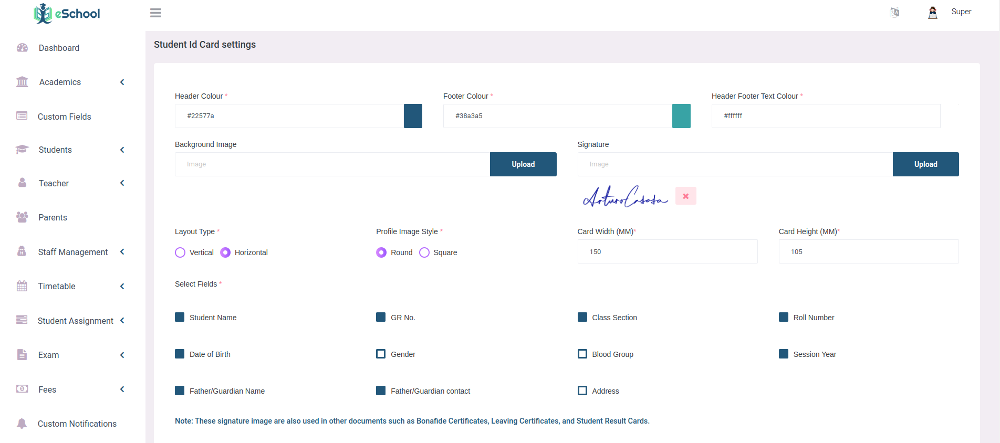
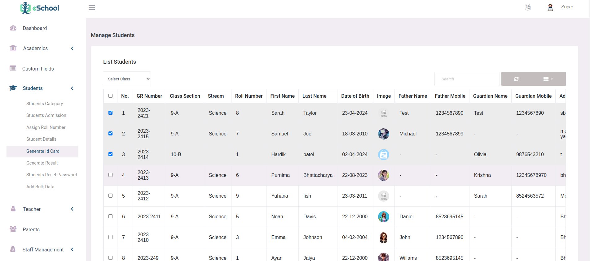
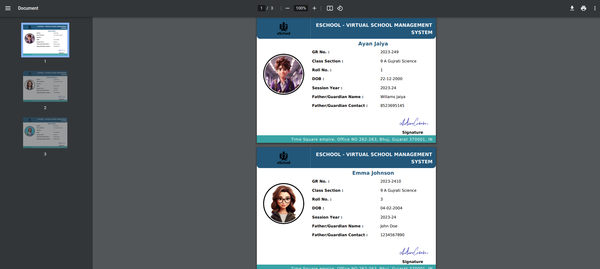
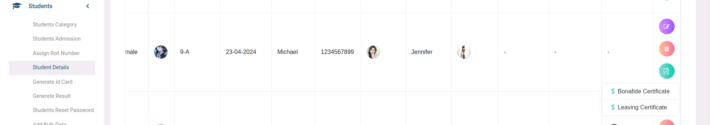
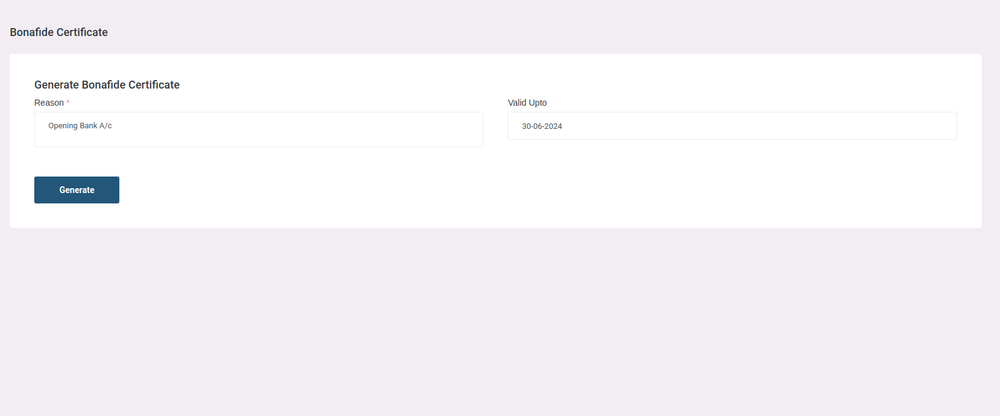
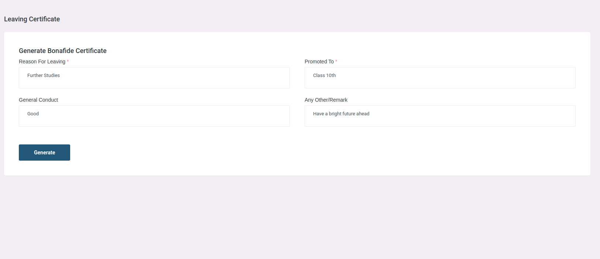
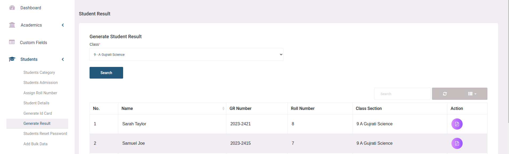

# Academic Document Generation

## ID Cards Setting

In the ID card settings, admins can customize how student ID cards look. They can change colors, add signatures, and even put background pictures. These options help make each ID card unique while still fitting the school's style.

## ID Cards List

In the Student >> Generate ID card section, Admin and Teacher can select students by checking the checkbox next to their names. Once they've selected the desired students, they simply click "Generate" to create ID cards specifically for those chosen students. This streamlined process ensures that ID cards are efficiently produced only for the selected students, saving time and effort for admin.

## School Bonafide Certificate & Leaving Certificate

In the Student Details section, Admin can swiftly produce bonafide and leaving certificates. These documents verify a student's enrollment status or departure from the institution, essential for tasks like visa applications or academic transfers.

Here, Admin can add additional details like reason and validity when generating bonafide certificates. This ensures accurate documentation for various purposes, such as scholarship applications or official requirements.

Admin can generate student's leaving certificate, include specific details such as the reason for leaving, the class to which the student is promoted, their general conduct, and any additional remarks. These details provide a comprehensive overview of the student's tenure at the institution, facilitating smooth transitions to new academic endeavors or other pursuits.

## Student's Result

In the "Generate Result" section, Admin and Teachers can access student results by selecting a class and clicking "search". They can then view individual student results with an interactive interface, downloading them as needed. Only published exam results are shown, ensuring privacy and accuracy.

**Note:**
- File Location to change content of Bonafide Certificate - resources/views/students/bonafide_template.blade.php
- File Location to change content of Leaving Certificate - resources/views/students/leaving_template.blade.php 