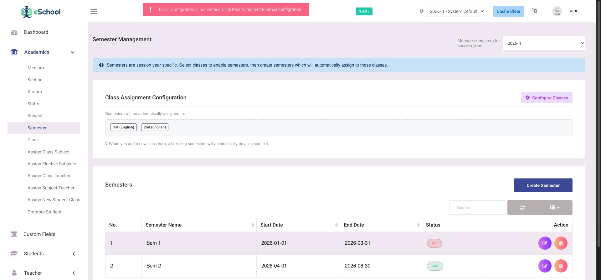

# Semester

This feature introduces a flexible, session-specific semester structure. Admins can now define semesters and associate them with classes on a per-session-year basis. This means a class can have semesters enabled in one academic year (e.g., 2025-26) and disabled in the next, without affecting historical data.

To support this, data management is now fully semester-aware. Academic modules—such as subjects, class teachers, timetables, assignments, and exams—are intrinsically linked to the specific semester within an active session year. Furthermore, when creating a new session year, admins can easily import configurations from any previous session year to carry forward data efficiently.