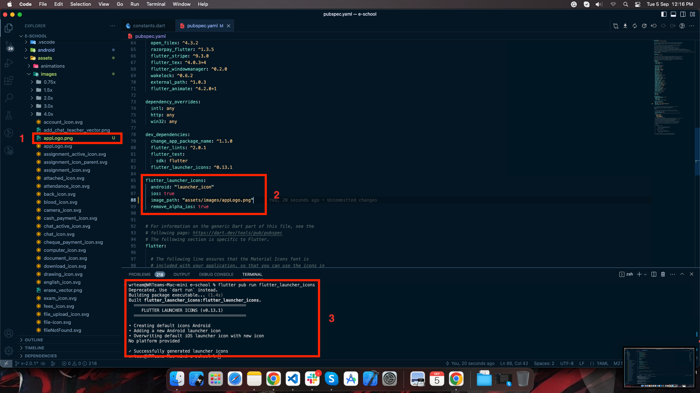

# Change app logo

## Add Logo Manually

For Android, open android > app > src > main > res and add here your logo according to device screen size 

For IOS open ios > Runner > Assets.xcassets > AppIcon.appiconset here and add your logo according to different size.

## Generate Logo Files With Package

1. Add your logo file in assets/images folder

2. Add it's path and filename in pubspec.yaml file under flutter_launcher_icons configurations

3. Run this command to generate the ic_launcher files for both Android and IOS:

   *flutter pub run flutter_launcher_icons*

 