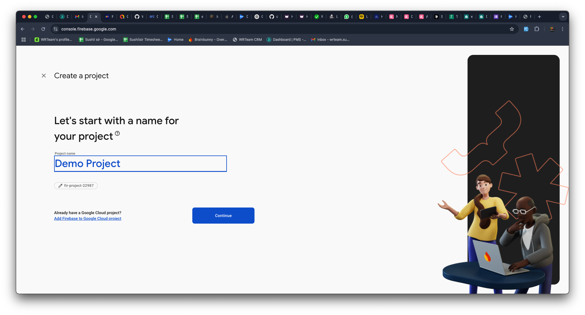
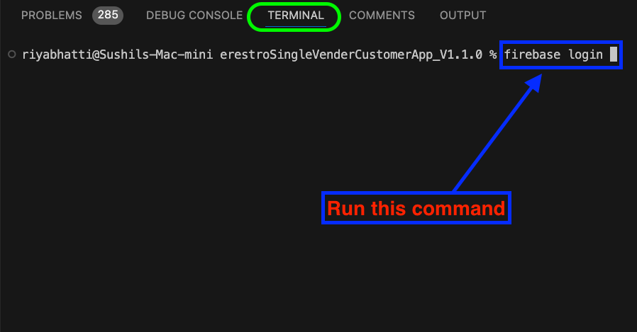
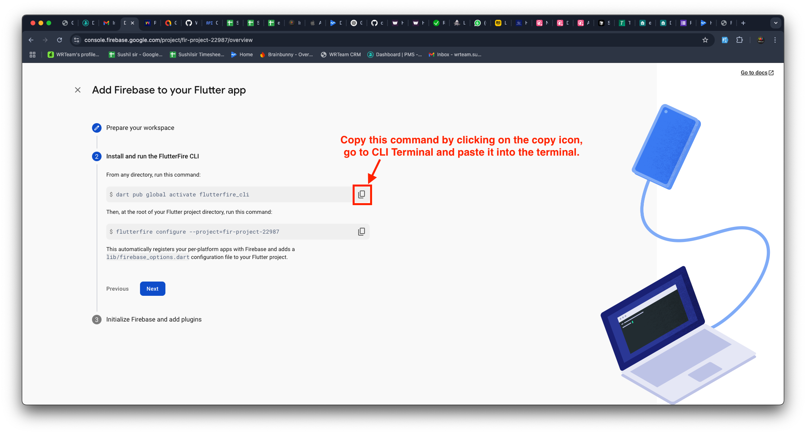
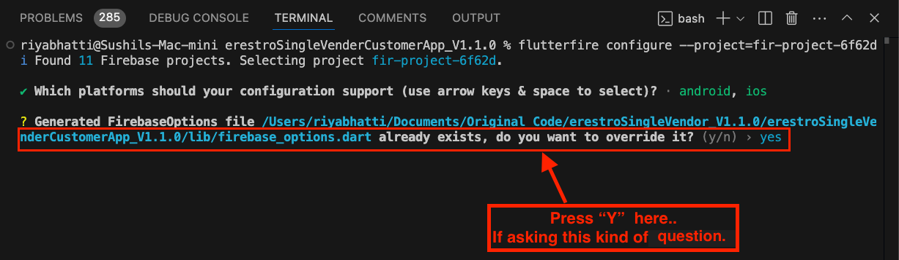

# Integrate with Firebase

### 1. Install Firebase CLI

Before creating a Firebase app from Flutter, you must install Firebase CLI.

Follow the official guide to install Firebase CLI: [Firebase CLI Installation Guide](https://firebase.google.com/docs/cli)

### 2. Create a Firebase Project

1. Open Firebase Console and click Create a Project.

2. Enter your project name and press Continue.

3. Press Continue on the next screen.

4. Click Create Project and wait for the setup to complete.
5. Once done, press Continue.

### 3. Create a Firebase App for Flutter

1. Select Flutter as the app type (refer to the image below).

2. Press Next to continue.

### 4. Log in to Firebase via Terminal

1. Open CLI Terminal (e.g., Visual Studio Code, Android Studio).
2. Run the following command to log in (if you are already logged in, then you can move to the [step 5](#5-run-firebase-initialization-commands)):

3. A browser window will open—log in to your Firebase account.
4. When prompted, allow Firebase to collect CLI usage data by entering YES and pressing Enter.

### 5. Run Firebase Initialization Commands

1. In CLI Terminal (e.g., Visual Studio Code, Android Studio), run the first Firebase setup command (as per the provided image).

2. Run the second Firebase setup command in the terminal.

3. When the terminal asks for confirmation, press Enter.

4. If prompted again, press Y to confirm.

### 6. Finalizing Firebase Setup

1. Press Next to continue.

2. Click Continue to Console.

### 7. Please configure this settings in-order to send ios notifications.

   [https://firebase.flutter.dev/docs/messaging/apple-integration](https://firebase.flutter.dev/docs/messaging/apple-integration)

### 8. You have configured Firebase in your project successfully