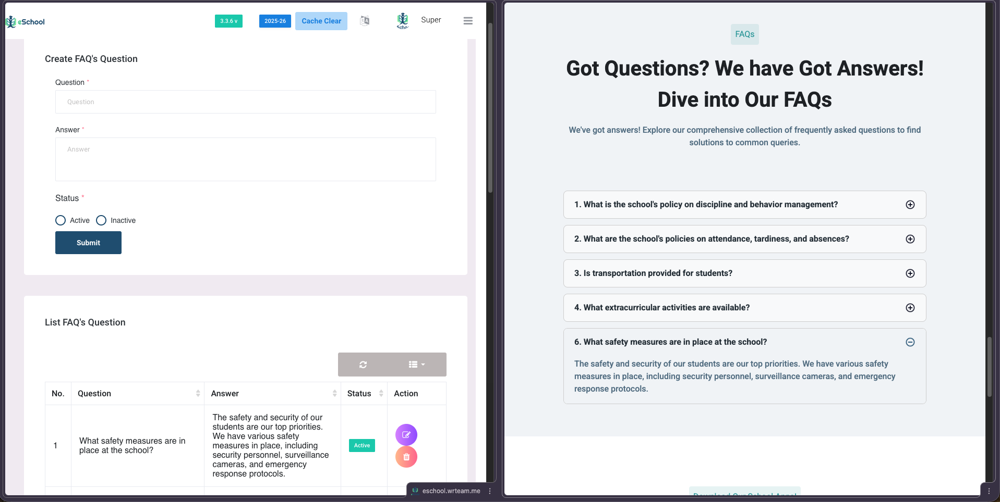

# FAQs Web

Admin can add and customize FAQs for users school-related inquiries from panel. With the ability to prioritize visibility, admins can easily activate or deactivate specific questions, providing them with seamless control over the visibility of FAQ content, ensuring relevance and clarity. This feature streamlines communication, providing users with essential information while maintaining flexibility for admin to manage content effectively. 